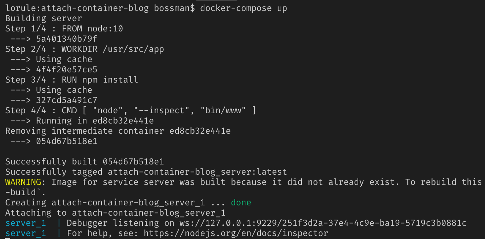
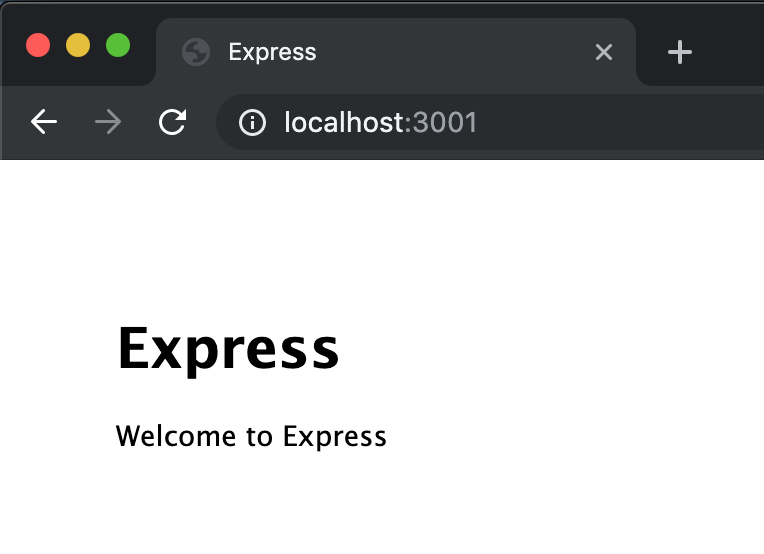
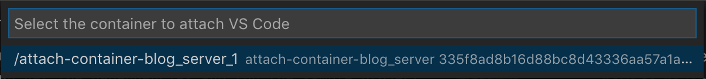
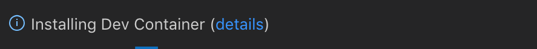
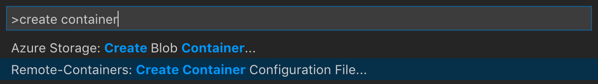
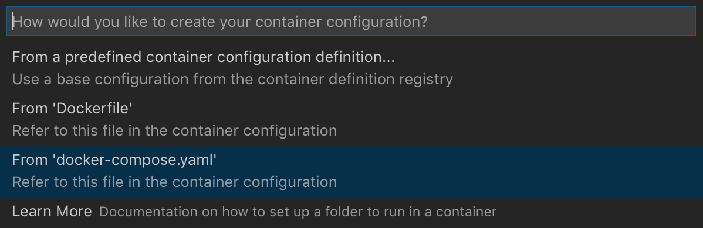

# Attaching VS Code to existing containers

The [Remote Containers extension](https://marketplace.visualstudio.com/items?itemName=ms-vscode-remote.remote-containers) has been available for a few months, and for the most part we've focused on using containers for [isolated development environments](https://code.visualstudio.com/remote-tutorials/containers/getting-started).
However in this post, we'll take a look at how you can use the Remote Containers extension to easily debug your containerized applications.

## Pre-reqs
If you want to follow along, you'll need:
- [Docker Desktop](https://www.docker.com/products/docker-desktop) running on your machine
- a containerized application to debug - if you don't have one, you can try [this sample](https://github.com/bowdenk7/attach-container-blog)
- the [Remote Containers extension](https://marketplace.visualstudio.com/items?itemName=ms-vscode-remote.remote-containers)

## Project Setup/Run
To get the dependencies and run the sample project, all you have to do is run:
```
docker-compose up
```

If everything worked you should get an ouput like this:


and you should be able to navigate to `localhost:3001` and see the following:


## Attaching to existing containers
We can now use the Remote Containers extension to attach to our running container.
Use the command palette (cmd + shift + p <replace with cool docs thing>) and search for the `Remote Containers: Attach to running container` command.

You will then be shown a list of your running containers.
Select the one we just started.



This will launch a new VS Code window that has the following notification in the bottom right.



VS Code is installing a copy of the VS Code server inside the container where you app is running.
We then connect from your local VS Code to the remote VS Code server.
The result is you have your local copy of VS Code with all your settings, themes, and keybindings, but it's running inside the container with your application.

This becomes clear if you open the terminal and poke around a bit:
```
root@335f8ad8b16d:~# whoami
root

root@335f8ad8b16d:~# uname
Linux

root@335f8ad8b16d:~# ls /usr/src/app
Dockerfile  bin  node_modules  package.json  routes  app.js  docker-compose.yaml  package-lock.json  public  views
```

At this point you can do anything that you can do in a normal local VS Code context. 
You can edit files, start and stop processes, check on setup and configuration, or whatever you need to work on your app.
Let's go ahead and open our app by clicking the "Open Folder" button and navigating to `/usr/src/app`.

## Debugging

To further show how similar the remote container is to a local environment, let's attach a debugger.
Our Node process is still running, so let's go back to the command palette and select `Debug: Attach to Node Process`.

There will probably be several Node processes running, but select the one that shows `bin/www`.


Open `index.js` and drop a breakpoint on line 6:

```js
res.render('index', { title: 'Express' });
```

Then navigate to `localhost:3001` in your browser and see the breakpoint trigger as expected!


## devcontainer.json

So you've seen how powerful it can be to work in VS Code running in the container, but currently every time we attach we have to reopen our project folder.
`devcontainer.json` is a config file that allows us to tell VS Code how to initiate the remote session, so we can use it to make sure our project folder is always open when we attach.

You can generate a `devcontainer.json` by running `Remote-Containers: Create Container Configuration File...` from the command palette.



In our sample project we have a `docker-compose.yaml` file, so we will generate the `devcontainer.json` from that.



Finally change the `workspaceFolder` option to `.` and we're good to go!

devcontainer.json:
```json
{
	"dockerComposeFile": "docker-compose.yaml",
	"service": "server",
	"workspaceFolder": ".",
	"extensions": []
}
```

Now when you attach VS Code to your running container, you won't have to reopen your project folder each time.

## Next Steps

In this post we covered how you can use the Remote Containers extension to attach to your existing containerized applications. 

You can also use the Remote Containers extension to build isolated development environments for non-containerized apps. Checkout the [tutorial here](https://code.visualstudio.com/remote-tutorials/containers/getting-started)!
